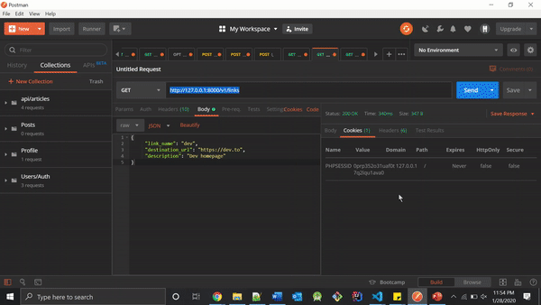

# Golinks API built with Vanilla PHP

A REST API for a URL shortener that replaces long URLs with short, easy to remember [golinks](https://medium.com/@golinks/the-full-history-of-go-links-and-the-golink-system-cbc6d2c8bb3). Users will create a link name and link it to the URL they want to shorten. All shorten URLs start with 'go/', followed by the link name i.e. 'go/git'. A golink will be distinct for every user. For example, 'go/git' will be different for Person A and Person B. Users will login, using their personal gmail, with Google Sign-In and can start creating their own golinks. The API is still a work in progress, but the main functionalities are working. You can play around with the API in your local development by following the instructions below.

## Initial Setup

- Clone this repo:

```bash
git clone https://github.com/ocastroa/golinks.git
```

- Install the dependencies:

```bash
composer install
```

- Since we will be using [PDO](https://phpdelusions.net/pdo#why), make sure that the extension "pdo_mysql" is uncommented in **php.ini**.

### Set up MySQL database

- In the root directory, create a **.env file**. Copy the variables from **.env.example** and enter your local credentials. Leave CLIENT_ID and CLIENT_SECRET as is for now. We will change those two variables shortly.

- Create a database table named 'golinks':

```bash
CREATE DATABASE golinks CHARACTER SET utf8mb4 COLLATE utf8mb4_unicode_ci;
```

- For the database 'golinks', create the tables for Users, Links, and Sessions by running the following script in the root directory:

```bash
php dbseed.php
```

### Set up the OAuth client credentials

- Since we are authenticating users using Google Sign-in, you need to create your OAuth client credentials to obtain the CLIENT_ID and CLIENT_SECRET. Look at the following [documentation](https://developers.google.com/identity/protocols/OAuth2) for an overview. You can also check out this [tutorial](https://www.webslesson.info/2019/09/how-to-make-login-with-google-account-using-php.html). Once you obtain the CLIENT_ID and CLIENT_SECRET, add them to the .env file.

- Final step is to disallow SSL verification to prevent a [PHP Fatal error](https://github.com/googleapis/google-cloud-php/issues/1821). Since we are in development mode, we don't need SSL verification. Go to the file found in "vendor\google\auth\src\HttpHandler\HttpHandlerFactory.php" and on line 34, make the following change:

```bash
$client = $client ?: new Client(['verify' => false]);
```

- In the root directory, start the PHP server:

```bash
php -S 127.0.0.1:8000 -t server
```

## Test the API endpoints

- We first need to authenticate the user, which would be you, in order to make any valid requests. To do so, go to the [OAuth 2.0 Playground](https://developers.google.com/oauthplayground/). Select 'Google OAuth2 API v2' and select the 'userinfo.email' and 'userinfo.profile' options. After clicking on 'Authorize APIs', click on 'Exchange authorization code for tokens' to get the access token.

- Include the access token inside the payload, with key name 'access_token', and send a POST request to 'http://127.0.0.1:8000/v1/auth'. Ex:

```bash
{
    "access_token": "ya29.Il-7ByIBj7KhYmJHWlL6OdhqZgwy_nrV6cqbDtsPnhXfyX2VS6L6d5-CJbit17tFi31wpaSaJP55UOqCpI75vM2z_rc6ajIln69V7KQ1S-3iQIpBA4z0m0bOLi8WdoKlmw"
}
```

- Now that you are logged in and have a sessions cookie, you can make requests to the other endpoints. Let's take a look at how to access your information, create a golink, get all the golinks you have created, and redirect a golink to a destination url. You can use Postman to test the endpoints.

### Access your information

- Make a GET request to 'http://127.0.0.1:8000/v1/users'. Your email is stored in the Sessions db (until you logout which will delete the session), so you don't have to add a param to the end of the endpoint. Example response:

```bash
{
    user_id: 1
    first_name: 'Oscar',
    last_name: 'Castro',
    email: 'oscarcastro@gmail.com',
    created_on: '2020-01-26 23:38:39'
}
```

### Create a golink

- Make a POST request to 'http://127.0.0.1:8000/v1/links'. Include the following in the request payload:

```bash
{
    link_name: (string) name of short link,
    destination_url: (string) url of destination link,
    description: (string) short description of link (optional)
}
```

- If successful, the response will return 201.

### Get all your golinks

- Make a GET request to 'http://127.0.0.1:8000/v1/links'. Example response:

```bash
[
    {
    link_id: 1,
    link_name: 'git',
    destination_url: 'https://github.com/ocastroa',
    description: 'My GitHub repo',
    visits_count: 2,
    email: 'oscarcastro@gmail.com'
    },
    {
    link_id: 2,
    link_name: 'dev',
    destination_url: 'https://dev.to/',
    description: 'Dev homepage',
    visits_count: 5,
    email: 'oscarcastro@gmail.com'
    }
]
```

### Redirect golink to destination URL

- Make a GET request to 'http://127.0.0.1:8000/v1/routings/:link_name'. Example request:

```bash
GET http://127.0.0.1:8000/v1/routings/dev
```

- Since a golink named 'dev' exists, we will be redirected to the destination URL. If we were to replace 'dev' with a golink that has not been created, we would be redirected to the dashboard.

- You can test the redirects in the browser. To do so, you must set the sessions cookie first by typing the following in the browser console (this was done in Chrome):

```bash
document.cookie="PHPSESSID=YOURSESSIONID; expires=0; path=/";
```

- Get the value of the session id from the Cookies Value in Postman.

- Now type the above GET request in the browser search bar and you should be redirected to the correct URL.

<p align="center">
  
</p>

- These were only some of the endpoints available. Play around with the other endpoints and make any changes you want.
